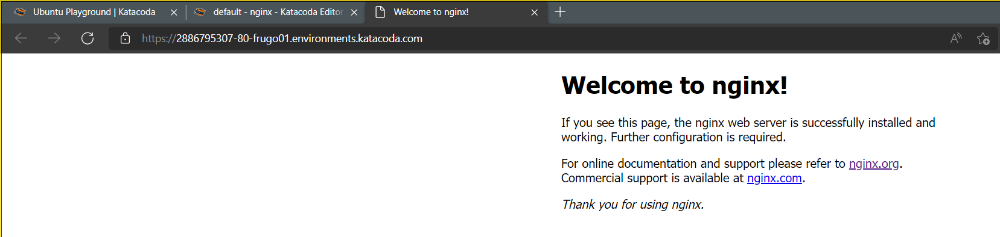

这节课的实验环境:https://www.katacoda.com/courses/ubuntu/playground2004


# 序言

Nginx是lgor Sysoev为俄罗斯访问量第二的rambler.ru站点设计开发的。从2004年发布至今，凭借开源的力量，已经接近成熟与完善。

Nginx功能丰富，可作为HTTP服务器，也可作为反向代理服务器，邮件服务器。支持FastCGI、SSL、Virtual Host、URL Rewrite、Gzip等功能。并且支持很多第三方的模块扩展。

Nginx的稳定性、功能集、示例配置文件和低系统资源的消耗让他后来居上，在全球活跃的网站中有12.18%的使用比率，大约为2220万个网站。

# Nginx的常用功能

## Http代理，反向代理：
作为web服务器最常用的功能之一，尤其是反向代理。

Nginx在做反向代理时，提供性能稳定，并且能够提供配置灵活的转发功能。Nginx可以根据不同的正则匹配，采取不同的转发策略，比如图片文件结尾的走文件服务器，动态页面走web服务器。并且Nginx对返回结果进行错误页跳转，异常判断等。如果被分发的服务器存在异常，他可以将请求重新转发给另外一台服务器，然后自动去除异常服务器。

## 负载均衡:
负载均衡（Load Balance）其意思就是分摊到多个操作单元上进行执行，例如Web服务器、FTP服务器、企业关键应用服务器和其它关键任务服务器等，从而共同完成工作任务。

Nginx提供的负载均衡策略有2种：内置策略和扩展策略。内置策略为轮询，加权轮询，Ip hash。扩展策略，就天马行空，只有你想不到的没有他做不到的啦，你可以参照所有的负载均衡算法，并通过编写lua脚本对他进行实现。

# 准备

在安装我们今天所需的软件前，先更新一下软件源和软件。

``` bash
#更新软件源
sudo apt update 
#更新软件
sudo apt upgrade -y
```
# 安装Nginx
## 通过包管理器(apt)从软件源直接安装Nginx

``` bash
#从软件源安装
sudo apt install nginx
```

安装好后即可查看nginx版本
``` bash
sudo nginx -v
```

从软件源安装是最简单的获取软件源的方式，大多数软件以及源码都能从系统官方的软件源中直接获取。
你只需要通过系统内置的包管理器，通过一行命令就能直接安装想要的软件，并且自动安装好需要的依赖。相比于Windows下繁杂的安装步骤，这显然方便多了。


包管理器在不同的系统可能不一样，在Debian/Ubuntu中，这个包管理器叫做apt,在RedHat/CentOS中,通常是yum。

## 从源码编译Nginx/下载二进制包

下载**二进制包**就相当于Windows中的绿色版软件，你能直接获取到软件的可执行文件，但是你需要自己放置对应的目录并管理好相关的服务。

**从源码编译**相对软件源和二进制包来说更加折腾一点的办法，但是当然也有对应的好处。

通过源码进行编译的软件有以下优点：
* 能获取最新的软件版本
* 在编译期针对运行的电脑硬件进行特别的优化
* 选择性地关闭或开启你需要的模块
* 精简软件和加载的库文件的数量
* 软件的运行效率会更高，启动速度会更快。

缺点就是安装以及编译**非常非常慢**，而且**非常非常麻烦**，并且如果要升级库文件或者升级软件往往需要重新编译。

包管理器直接安装或者直接下载获取的二进制文件进行安装，为了保证兼容性，通常获取到的软件的优化都会比较保守。

通常来说这个方案仅供学习，这个作为作业。

最新的Nginx源码的下载地址可以在[Nginx的官网的下载页面](https://nginx.org/en/download.html)内找到。
``` bash
#通常软件源码的放置目录，以后会详细介绍Linux下每个目录的作用
cd /usr/local/src/
#下载
wget https://nginx.org/download/nginx-1.20.2.tar.gz
#解压
tar zxvf nginx-1.20.2.tar.gz
#进入解压好的目录
cd nginx-1.20.2
#安装好我们这次编译所需要的依赖库 这些对应了nginx的常用的一些基础扩展
sudo apt install libpcre3 zlib1g-dev openssl
#编译前的预配置，这里的--prefix代表了可执行文件所放置的目录,--with代表了我们要开启的nginx组件，具体组件的用途不需要特别去了解，但是当你需要扩展Nginx的功能时候可以查看。
./configure --prefix=/usr/local/bin/nginx --with-http_stub_status_module --with-http_ssl_module --with-pcre
#编译并安装,这里使用的make指令是Linux下的一个通用的编译工具，可以通过编写makefile来自定义程序的编译过程。
make
make install
#查看nginx版本信息
/usr/local/bin/nginx/sbin/nginx -v
$ nginx version: nginx/1.20.2
```
如果最后出现版本信息，则说明安装成功了。

> 这里的**make**就是linux下的一个通用的编译工具，只要是有**makefile**的软件源码都可以通过类似的步骤进行编译和安装。**make**通常用于编译C/C++的源码，但是你当然也可以用它来做别的事情。
有条件的话可以深入的学习一下make的使用方法makefile的编写方式。

此时在浏览器打开你的IP地址，就能看到nginx的默认页面。


# 配置Nginx并上线应用
先clone下我们这次的示范项目。
``` bash
cd ~
git clone https://github.com/YuuinIH/elc-study.git
cd elc-study
ls
```
`./springboot-project`目录下放着我们这次要部署的后端项目，实际上这个就是springboot官网上的Demo。它只提供了一个端口`/hello`，当你发送Get请求时时，它会回应一个`Hello World`的文本串.

`./vite-project`目录下放着我们这次要部署的前端项目，我为它加了一个文本框和按钮，它可以请求上面后端的这个api并且让他在dom里展示出来。

接下来介绍如何配置nginx并在我们的项目中上线这两个前后端应用。

## 网页编译
Nginx的一个最主要的功能就是提供静态的html页面或者图像。

先为我们的网页文件进行打包，以便nginx使用。

安装Node.js，这里建议自行查看[Node.js的下载页](https://nodejs.org/zh-cn/download/)查看安装方法

个人建议的方法:
* [使用包管理器中安装](https://nodejs.org/zh-cn/download/package-manager/)
* [在 Linux 上，通过二进制文件安装(English)](https://nodejs.org/zh-cn/download/package-manager/#debian-and-ubuntu-based-linux-distributions-enterprise-linux-fedora-and-snap-packages)
> 查看[包管理器安装的手动安装方法](https://github.com/nodesource/distributions/blob/master/README.md#manual-installation)可以发现，通过上面方法的包管理器安装，会为`/etc/apt/sources.list.d/`里添加一个nodesource.list的文件，相当于在系统内置的官方软件源的基础上，添加了由Node.js官方提供的一个第三方软件源。这个软件源只提供Node.js的软件包，并且可以在`apt update`后直接通过`apt install nodejs`进行安装。系统内置的官方源的软件版本并不会在第一时间更新到最新。第三方软件源的安装方式在享受到包管理器的便利，与第一时间尝鲜最新的版本两种需求之间得到了一定的平衡。

先给前端的网页进行打包。
``` bash
cd vite-project/
npm i
npm run build
```
打包好的网页文件位于`./dist`下,我们将打包好的网页文件移动出我们的项目文件夹。
``` bash
mkdir -p /var/www/studyweb
cp -ra dist/* /var/www/studyweb
```

接下来开始为我们的网页文件配置nginx代理。
## Nginx配置文件
先简单的介绍nginx本体的主要配置。
``` bash
#移动到nginx的配置文件夹
cd /etc/nginx
ls
$ ls
conf.d        fastcgi_params  koi-win     modules-available  nginx.conf    scgi_params      sites-enabled  uwsgi_params
fastcgi.conf  koi-utf         mime.types  modules-enabled    proxy_params  sites-available  snippets       win-utf
```
可以使用下面的命令来查看默认配置文件。
```
cat nginx.conf
```
可以发现内容比较多，我们用grep命令去掉其中的注释。
``` bash
cat nginx.conf | grep -vE "#|^$"
```
``` bash
$ cat nginx.conf | grep -vE "#|^$"
user www-data;
worker_processes auto;
pid /run/nginx.pid;
events {
        worker_connections 768;
}
http {
        sendfile on;
        tcp_nopush on;
        tcp_nodelay on;
        keepalive_timeout 65;
        types_hash_max_size 2048;
        include /etc/nginx/mime.types;
        default_type application/octet-stream;
        ssl_prefer_server_ciphers on;
        access_log /var/log/nginx/access.log;
        error_log /var/log/nginx/error.log;
        gzip on;
        gzip_disable "msie6";
        include /etc/nginx/conf.d/*.conf;
        include /etc/nginx/sites-enabled/*;
}
```
注意到倒数第二行和倒数第三行的 include，它表示将 /etc/nginx/conf.d/ 目录下以 .conf 结尾的文件和目录 /etc/nginx/site-enabled/ 下的所有文件直接包含进来。你可以理解为将文件的内容直接复制到这里（即 /etc/nginx/nginx.conf 中）。

比如我在 /etc/nginx/conf.d/ 目录中有一个 test.conf，它的内容是：
``` test.conf
server {
    #...
}
```
那么这些内容将替换 include /etc/nginx/conf.d/*.conf。nginx.conf 的内容，相当于：
```
#...
http {
    #...
    gzip on;
    gzip_disable "msie6"

    server {
        #...
    }

    include /etc/nginx/sites-enabled/*;
}
```
Main 就是我们的配置文件，配置文件中的 events{...} 对应 Events，http{...} 对应 Http。

在 nginx.conf 中是不是没有发现定义的 server {}？

原因是：为了方便维护我们 server 相关配置，不会让某一个配置文件过于庞大。通常是将所有的虚拟主机配置文件（也就是 server 配置块的内容）存放在 /etc/nginx/conf.d/ 或者 /etc/nginx/sites-enabled/ 目录中，在主配置文件中已经默认声明了会读取这两个文件夹下所有 *.conf 文件。

一个典型、完整的静态 Web 服务器还会包含多个 server 配置块，例如 /etc/nginx/sites-enabled/default。
``` bash
$ cat sites-available/default | grep -vE "#|^$"
server {
        listen 80 default_server;
        listen [::]:80 default_server;
        root /var/www/html;
        index index.html index.htm index.nginx-debian.html;
        server_name _;
        location / {
                try_files $uri $uri/ =404;
        }
}
```
这里简单介绍每一部分的作用
``` default
server {
        # 监听默认的http端口80
        listen 80 default_server;
        listen [::]:80 default_server;
        # 定义服务器的默认网站根目录位置
        root /var/www/html;
        # 主页的文件名
        index index.html index.htm index.nginx-debian.html;
        # 定义虚拟服务器的host，也就是你在浏览器地址栏输入的域名/ip地址
        server_name _;

        # location部分，用于匹配链接到指定的文件上。
        location / {
                try_files $uri $uri/ =404;
        }
}
```
在配置文件中可以看到，如果我们想修改 Server 的端口为 8080，那么就可以修改 listen 80 为 listen 8080。访问网站的时候应该是 网站:8080，其中 :8080 表示访问 8080 端口。如果是 80 端口，可以省略不写。

如果我们想更改网站文件存放的位置，修改 root 就可以了。

> 每一行的指令都是以分号结尾的！！！不要忘记写了！！

其中 location 用于匹配请求的 URI。

URI 表示的是访问路径，除域名和协议以外的内容，比如说我访问了 https://www.foo.bar/louplus/linux，https:// 是协议，www.foo.bar 是域名，/hello 是 URI。

location 匹配的方式有多种：

精准匹配
忽略大小写的正则匹配
大小写敏感的正则匹配
前半部分匹配
其语法如下：

```
location [ = | ~ | ~* | ^~ ] pattern {
#    ......
#    ......
}
```
其中各个符号的含义：

* =：用于精准匹配，想请求的 URI 与 pattern 表达式完全匹配的时候才会执行 location 中的操作
* ~：用于区分大小写的正则匹配；
* ~*：用于不区分大小写的正则匹配；
* ^~：用于匹配 URI 的前半部分；
我们以这样的实例来进一步理解：
```
location = / {
    # [ 配置 A ]
}

location / {
    # [ 配置 B ]
}

location /documents/ {
    # [ 配置 C ]
}

location ^~ /images/ {
    # [ 配置 D ]
}

location ~* \.(gif|jpg|jpeg)$ {
    # [ 配置 E ]
}
```
当访问 www.foo.bar时，请求访问的是 /，所以将与配置 A 匹配；

当访问 www.foo.bar/test.html 时，请求将与配置 B 匹配；

当访问 www.foo.bar/documents/document.html 时，请求将匹配配置 C;

当访问 www.foo.bar/images/1.gif 请求将匹配配置 D；

当访问 www.foo.bar/docs/1.jpg 请求将匹配配置 E。

当一个 URI 能够同时配被多 location 匹配的时候，则按顺序被第一个 location 所匹配。

在 location 中处理请求的方式有很多，如上文中的 try_files $uri $uri/ =404;，它是一种特别常用的写法。

我们来分析一下 try_files $uri $uri/ =404;。这里假设我定义的 root 为 /usr/share/nginx/html/，访问的 URI 是 /hello/world。

第一步：当 URI 被匹配后，会先查找 /usr/share/nginx/html//hello/world 这个文件是否存在，如果存在则返回，不存在进入下一步。
第二步：查找 /usr/share/nginx/html//hello/world/ 目录是否存在，如果存在，按 index 指定的文件名进行查找，比如 index.html，如果存在则返回，不存在就进入下一步。
第三步：返回 404 Not Found。

# 开始为网页配置nginx
我们使用之前记录下的路径，创建一个新的配置文件。
```
cd /etc/nginx/sites-enabled/
sudo touch elcstudy.conf
#用vim编辑配置文件
vim elcstudy.conf
```
这里 我们让我们的nginx监听8070端口,root为`/var/www/studyweb`。写入以下内容
``` studyweb
server {
    listen 8070 default_server;

    root /var/www/studyweb;

    index index.html index.htm;

    server_name localhost;

    location / {
        try_files $uri $uri/ =404;
    }
}
```

修改完毕后，保存退出。

完成nginx配置文件的修改后，不要忘记通过nginx -t对我们修改的配置文件进行加载的测试。随后我们对nginx进行重载。
``` bash
$ nginx -t
nginx: the configuration file /etc/nginx/nginx.conf syntax is ok
nginx: configuration file /etc/nginx/nginx.conf test is successful
#显示该内容则测试通过
$ nginx -s reload
#让nginx重载配置文件
```
随后在浏览器里打开`http://yourhost:8070`，就能看到我们的网页了。


## 后端部分
先安装JDK。
``` bash
#搜索使用的JDK版本,你可以选用你需要的JDK版本
sudo apt search jdk
#这里以JDK11为例,安装JDK
sudo apt install openjdk-11-jdk
#显示JDK版本
java -version
```
为我们的SpringBoot项目进行打包。
``` bash
cd springboot-project
#为mvnw添加可执行权限
sudo chmod +x mvnw
#为springboot项目进行打包,拉依赖会有亿点久。
./mvnw clean package
#如果出现了demo-0.0.1-SNAPSHOT.jar，那就是打包成功了。
ls target/
#尝试运行jar
java -jar target/demo-0.0.1-SNAPSHOT.jar
```
这时候我们访问ip:8080/hello，可以看到我们的后端正常的返回Hello World了。


通常部署在服务器上的只需要这个jar文件就足够了，但是我们的应用还有一个明显的问题。我们的应用一旦关闭了终端也就宕机了，必须要一直开着终端才能保持运行。

关于第一个问题可以查看：[linux后台运行的几种方式](https://www.cnblogs.com/zsql/p/10827587.html)。

这里以screen为例。
``` bash
#在screen的虚拟终端中后台运行我们的服务
screen -S spring
java -jar target/demo-0.0.1-SNAPSHOT.jar
```

接下来我们为我们的spring-boot应用配置代理,使我们的网页能够调用我们的api。

我们重新打开刚才的`/var/www/studyweb`。为我们的后端添加api的location。
```
cd /etc/nginx/sites-enabled/
sudo touch elcstudy.conf
#用vim编辑配置文件
vim elcstudy.conf
``` studyweb
server {
    listen 8070 default_server;

    root /var/www/studyweb;

    index index.html index.htm;

    server_name localhost;

    #将所有的api的请求全部转发到localhost:8080,即我们的后端服务器上。
    location /api/ {
        proxy_pass http://localhost:8080/;
    }

    location / {
        try_files $uri $uri/ =404;
    }
}
```

修改完毕后，保存退出。

``` bash
$ nginx -t
nginx: the configuration file /etc/nginx/nginx.conf syntax is ok
nginx: configuration file /etc/nginx/nginx.conf test is successful
#显示该内容则测试通过
$ nginx -s reload
#让nginx重载配置文件
```
回到我们的网页，发现我们的接口能够正常的被网页调用了。

> 我们在开发的时候通常都会用./mvnw spring-boot:run或者npm run dev这样的指令来启动一个本地的服务器，他们使用的默认端口通常是8080。我们可以通过修改其中的配置文件使他们直接在开启在443或者80端口上。你能说出这有什么弊端吗？
